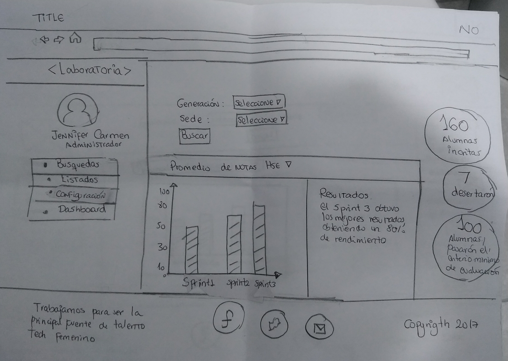

# Sketch para Dashboard de laboratoria

* **Curso:** _Creando tu primer sitio web interactivo_
* **Unidad:** _Intro a User Experience Design_

***
## Objetivo
En el siguiente reto se nos pide realizar el sketch del dashboard para  laboratoria.
El dashboard es una herramienta utilizada por profesores, training managers, directores y gerentes de Laboratoria para ver rápidamente qué está pasando en el salón de clases de Laboratoria. En el dashboard, los usuarios mencionados pueden ver rápidamente estadísticas y datos en tiempo real como:

# de alumnas inscritas
# de alumnas que desertaron
# y % de alumnas que pasan el criterio mínimo de evaluación
Promedio de notas por sprint
Promedio de notas HSE
Promedio de notas técnicas
Además, dado que Laboratoria tiene muchas generaciones, regularmente 2 generaciones por año (estas generaciones empezaron en el 2014), y que opera en 4 sedes (Arequipa, Ciudad de México, Lima y Santiago de Chile), es posible que los usuarios quieran ver datos de sedes / generaciones anteriores para poder hacer comparaciones.

## Sketch

## Anotaciones

 
 ## Creditos

 JENNIFER CARMEN